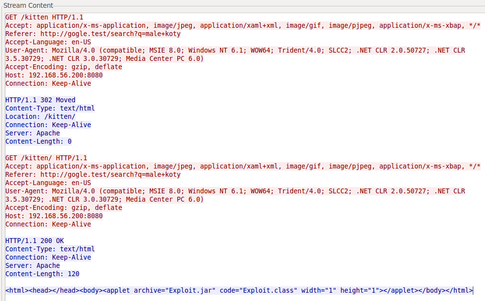
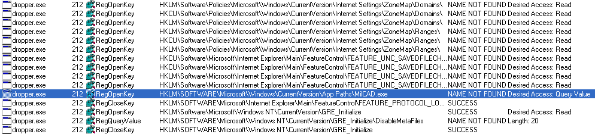
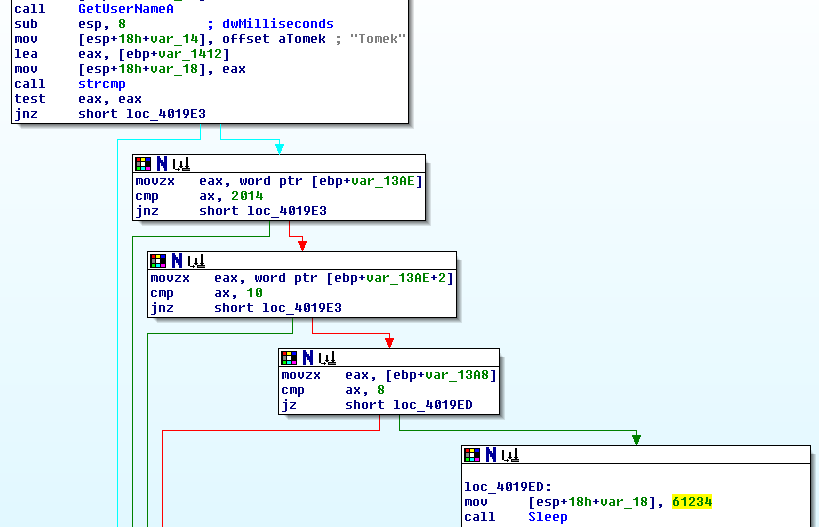
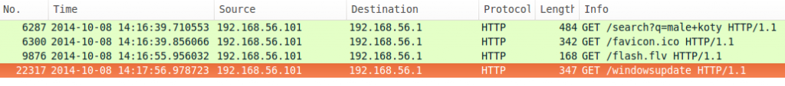
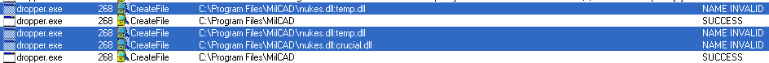
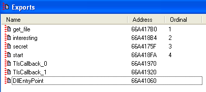
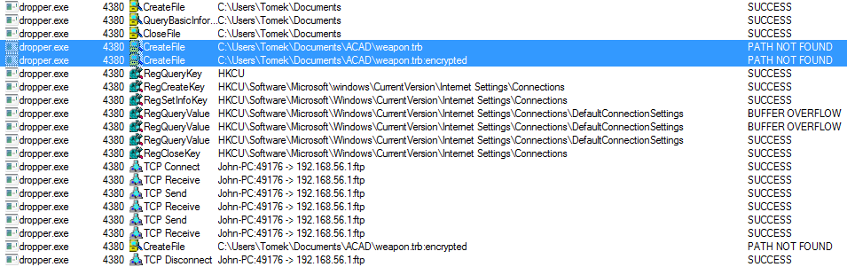
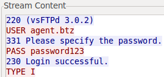

## What did Tomek do?
Most probably Tomek did fall into one of the more popular social engineering attacks. The connection to
`http://gogle.test/search?q=male+koty`
was made probably by clicking on some link in the spam message, which Tomek was known to do. This page contained an
`iframe`
which led to the
`http://192.168.56.200:8080/kitten`
URL. This URL contained an
`applet`
element, which run the
`Exploit`
class from the
`Exploit.jar`
file.



Some of you may have noticed that this file was created using the Metasploit Framework and the CVE-2012-4681 vulnerability in the Java browser plugin. After the exploitation phase a PE file was downloaded from the
`http://adbe.test/flash.flv` URL. This PE file was packed using a UPX packer. Unpacking can be simply done by running the
`upx -d file.exe`
command.

## What did dropper do?
Let’s try running dropper on a virtual machine. We will be using SysInternals Suite to analyze this malware, specifically Process Monitor (ProcMon.exe) tool. Screenshot below shows what happens when you run the dropper. It tries to read a registry key that shows a path to the `MilCAD.exe`
file. You have to create an empty directory (e.g.
`C:\Program Files\MilCAD`
) and put it as a registry key value.



This did not change too much, dropper still seems not to run at all. We have to fire up a dissembler, like the free version of IDA 5.0. The string that stands out the most is
`Tomek`
. This is in line with the employee that was targeted in this attack. Let’s follow that string to the place where it is used in the PE file. Screenshot below is the actual part of the code where the string is used to check whether the current user account name is
`Tomek`
and if the system date is set to the 8th of October, 2014 (this is a date extracted from the PCAP file).



If both of this conditions are fulfilled, dropper sleeps for over a minute and goes on to other instructions. After creating the specified user account and changing the system date to 8th of October, 2014, dropper run longer and makes a request to the `http://micrsoft.test/windowsupdate`
URL. This is consistent with the traffic dump, as can be seen on a screenshot below.



In order to redirect the request to our HTTP server, we only need to change the IP – domain mapping using the following entry in the `%SystemRoot%\system32\drivers\etc\hosts`
file.

```
YOUR_SERVER_IP_ADDRESS micrsoft.test
```

You also have to upload the
`windowsupdate`
file extracted from the given PCAP file. After the dropper is started again it should download the correct file and write some data to two different files, as presented on the screenshot below.



If the file system is different than NTFS, you will see the same output as on the screenshot above. This effect is caused by fact that dropper uses the NTFS feature called Alternate Data Stream. If the file is NTFS than we can go to the path visible above, but we will only see the empty
`nukes.dll`
file. In order to see the ADS content, we can use the NirSoft AlternateStreamView. It is very simple to use: just select the directory in which the
`nukes.dll`
file is and select
`Export Selected Streams To...`
along with the empty export directory. This is where all the ADS data will be written.

You now have the plaintext version of the library that was on the Tomek’s computer.

## What did the DLL file do?
This downloaded DLL was loaded into the process memory and run from the dropper process. It was also packed with UPX and you can see a couple of different exported functions after the unpacking, as pictured below.



Process Monitor logs show that dropper tried to access the
`C:\Users\Tomek\Documents\ACAD\weapon.trb`
file and we can assume that this was the extracted file. If you want to make sure that this indeed is the extracted file, you can analyze the dropper and DLL code in IDA. Additionally, the DLL file uses the same Alternate Data Stream technique as the dropper in order to encrypt the file before sending it.



Since we already have the filename, all that is left is the file contents. If the cipher used to encrypt the file is a stream cipher than sending the encrypted file should decrypt it. If you try to save the encrypted file extracted from the PCAP as
`C:\Users\Tomek\Documents\ACAD\weapon.trb`
and run the dropper again, it should try to send the decrypted version of the file. All that is left is installing the FTP server and redirecting the connection as we did with the HTTP server above. Just remember to accept connection that authenticate using the data from the screenshot presented below.



The uploaded FTP file is indeed the solution (as you can see by opening it) and indeed a strem cipher was used by the malware.

## Solution
The correct solution was:

* SHA256: `fc1e152ad4fce16b490009ae0bd2994f72d911e3ca7e153f162322a66a0dbe90`
* Filename: `weapon.trb`
