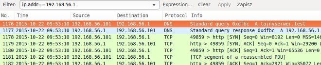
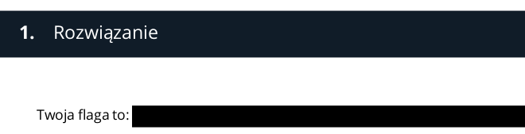

## Rozwiązanie
W zadaniu prosiliśmy o znalezienie flagi – ciągu znaków, który będzie znajdował się pomiędzy
`flag{`
a
`}`
. Flagę tę znaleźć trzeba było w pliku PCAP, który udostępniliśmy. Po rozpakowaniu pliku i otwarciu za pomocą darmowego narzędzia Wireshark. Poniżej znajduje się zrzut ekranu, na którym widać podejrzaną komunikację z sewerem
`tajnyserwer.test`
.



Z dwóch strumieni TCP skierowanych do
`tajnyserwer.test`
możemy wyodrębnić plik JPG oraz plik 7zip. Najprościej można to zrobić korzystając z opcji
`File|Export Objects|HTTP`
i wybierając obie komunikacje. Kiedy to zrobimy plik 7zip okazuje się być zaszyfrowany i jesteśmy proszeni o podanie hasła. Hasło do tego pliku znajduje się w informacjach EXIF zdjęcia katedry, jako
`Title`
. Można wydobyć tę informację np. za pomocą narzędzia
`exiftool`
:

```
$ exiftool photo.jpg
Title: 4F5dzRYXBTNmM2jT
Comment: File source: https://commons.wikimedia.org/wiki/File:Catedral_de_Salisbury,_Salisbury,_Inglaterra,_2014-08-12,_DD_49.JPG
```

Po wpisaniu hasła
`4F5dzRYXBTNmM2jT`
jesteśmy w stanie rozpakować plik
`matrioszka.zip`
, który również jest spakowany z hasłem. Ponieważ jednak nie jest zaszyfrowana lista plików, widzimy już co nas czeka w następnym etapie: najprawdopodobniej skrypt języka Python (
`decrypt.py`
) oraz zaszyfrowane dane (
`tajne.data`
).

Hasło do pliku zip znajduje się również w informacjach EXIF. Tym razem jednak trzeba zwrócić uwagę na współrzędne geograficzne:

```
GPS Latitude                    : 35 deg 41′ 6.00″ N
GPS Longitude                   : 139 deg 45′ 5.00″ E
GPS Position                    : 35 deg 41′ 6.00″ N, 139 deg 45′ 5.00″ E
```

Jak wywnioskować można z komentarza EXIF do zdjęcia jest to katedra w Salisbury w Anglii. Współrzędne geograficzne wskazują jednak na zupełnie inne miejsce – okolice Pałacu Cesarskiego w Tokio. I właśnie
`Tokio`
jest hasłem do pliku zip. Po rozpakowaniu i zajrzeniu w skrypt języka Python widzimy, że przyjmuje on trzy parametry: hasło, plik wejściowy i plik wyjściowy.

Z hasła jest tworzony 32-bajtowy (256 bitów) klucz AES, którym to algorytmem następnie jest odszyfrowywany plik wejściowy. Jednak tylko 5 znaków hasła jest wykorzystywanych do wytworzenia klucza. Co więcej muszą być to litery bądź cyfry. Ogranicza to znacząco liczbę możliwych kombinacji i powoduje, że wykorzystanie metody brute-force może okazać się opłacalne. Jednak musimy za każdym razem sprawdzić czy wynikowy plik jest rzeczywiście tym czego szukamy. Możemy to zrobić ograniczając pulę otrzymywanych plików do sensownych typów, np. plików PDF (co po naszej podpowiedzi było już oczywiste). Po znalezieniu odpowiedniego hasła (
`VbrFv`
) otrzymujemy zaszyfrowany plik PDF. Hasło do tego pliku znajduje się w początkowym pliku PCAP, w rekordzie TXT odpowiedzi DNS, jak pokazano poniżej.


Po wpisaniu hasła widzimy dokument taki jak na obrazku poniżej. Można spróbować uzyskać flagę zaznaczając zaciemniony prostokąt i przekształcając ciąg znaków zakodowany base64 na postać jawną, ale wtedy otrzymamy tylko
`This is not the flag that you are looking for`
.



Prawdziwa flaga znajduje się w stopce dokumentu i jest napisana białą czcionką. Poprawna odpowiedź to:
`NagrodaJestDlaMnie`.
