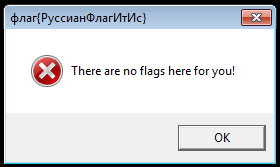
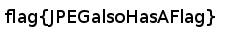
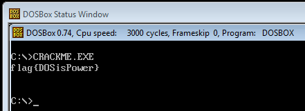

## Flag: `ThisWasEasyToFind!` (20 submissions)

A couple of minutes after we announced our challenge the file has already been uploaded to VirusTotal. Two of the tested antivirus solutions reported a false positive. The “File details” tab contains one of the flags. This was hidden in the “Comments” string of the file metadata. This data is displayed (at least in Windows XP) upon right clicking on the file and choosing “Properties”, as the screenshot below shows. 

 

Alternatively, one could run the
`strings`
tool with
`-e l`
. This option resulted in showing the strings which where encoded in 16-bit Unicode in the Little Endian convention. The command is presented below, flag is in the 9th line.

```
$ strings -e l ./CrackMe.exe
INTERESTING_PCITURE
VS_VERSION_INFO
VarFileInfo
Translation
StringFileInfo
04090025
Comments
flag{ThisWasEasyToFind!}
CompanyName
CERT Polska
FileDescription
CrackMe
FileVersion
InternalName
LegalCopyright
CERT Polska
LegalTrademarks
OriginalFilename
PrivateBuild
ProductName
CrackMe
ProductVersion
SpecialBuild
```

## Flag: `HowToFindStringsInPEYouKnow` (15 submissions)

This flag could also be found by using the
`strings`
tool. However, this time the binary file had to be unpacked. This file was packed with UPX, however one of the section names was changed. This resulted in a failure when one tried to use the standard tool:

```
$ upx -d ../CrackMe.exe
Ultimate Packer for eXecutables
Copyright (C) 1996 - 2013
UPX 3.09 Markus Oberhumer, Laszlo Molnar &amp; John Reiser Feb 18th 2013

File size Ratio Format Name
-------------------- ------ ----------- -----------
upx: ../CrackMe.exe: CantUnpackException: file is modified/hacked/protected; take care!!!

Unpacked 0 files.
```

Offsets 179-17C contained a
`XXX0`
string, while normally it should be
`UPX0`
. This name change could be reversed using a standard text editor. After this change file should unpack normally and after running the
`strings`
tool we find a string:
`ZmxhZ3tIb3dUb0ZpbmRTdHJpbmdzSW5QRVlvdUtub3d9Cg==`
which is just a base64 encoded flag.

## Flag: `HaveNoFear,ConsoleFlagIsHere!` (13 submissions)

This flag was also easy to find. All you have to have is
`windows\system32\cmd.exe`
running in the background, while starting our CrackMe. Flag was then written in the console, as is pictured below.


## Flag: `VeryGoodHardDriveName` (10 submissions)

Second dialog box that was showed when you simply run
`CrackMe.exe`
is the one pictured below.


It contained a clue that pointed to the Andromeda malware. This malware had a VM check implemented, and if it succeeded in detecting the VM than it executed a decoy code. However, malware authors also have tested Andromeda in a virtual environment, so they implemented a check that allowed users to bypass the VM detection. If the
`C:`
had a label with CRC32 equal to
`0x20C7DD84`
(most notably
`CKF81X`
) our CrackMe displayed a new flag (pictured below).


## Flag: `YouKnowHowToDebugCode!` (9 submissions)

In order to find this flag CrackMe had to be debugged using e.g. OllyDbg or IDA Pro. The code check the debugger presence using the
`IsDebuggerPresent`
function. If it detected the debugger a
`You shall not pass!`
dialog box appeared. However, code continued to the function which used
`OutputDebugString`
to display a string. This string was obtained by xoring
`changeme`
with the previously “encrypted” byte array:

```
0x39,0x47,0x47,0x46,0xa,0x6,0x44,0x53,0x6a,0x1f,0x30,0x5c,0x6e,0x4e,0x6,0xb,0x44,0x62,0x44,0x13,0x2a,0x4c,0x65,0x4e,0x15,0x3a,0xa,0x5b
```

Of course
`changeme`
had to be change to the correct password. Assuming that we know that the first 5 characters of the string are
`flag{`
, and only first 5 bytes from
`changeme`
were used as a key, we could easily calculate correct password:

```
0x39 xor 0x66 (‘f’) = 0x5f (‘_’)
0x47 xor 0x6c (‘l’) = 0x2b (‘+’)
0x47 xor 0x61 (‘a’) = 0x26 (‘&’)
0x46 xor 0x67 (‘g’) = 0x21 (‘!’)
0x0a xor 0x7b (‘{‘) = 0x71 (‘q’)
```

So the password is
`_+&!q`
and it can be used to decode byte array and obtain a flag. This can be achieved manually or by simply substituting
`changeme`
with
`_+&!q`
in the debugger.

## Flag: `RussianFlagItIs` (8 submissions)



This flag was relatively easy to find, but people who did find it often did not know what to do with it. This flag was in the caption of the first dialog that was displayed when running CrackMe. It was written in Cyrillic and it needed to be transliterated to latin (or ASCII) alphabet. Few people, who apparently did not read the rules carefully, submitted the flag using original Cyrillic alphabet. Rules clearly stated that the flag had to start with
`flag{`
and that it had to be a string composed of ASCII printable characters excluding whitespaces. This transliteration could be performed using Google Translate or manually. Another problem was the similarity between the letters: ф and Ф (small and big “f” letter). Some even chose to ignore the case all together. However, this problems only concerned two participants.

## Flag: `RC4EncryptionIsFun!!!1` (6 submissions)

CrackMe created a system file
`decode.py`
in the
`%TEMP%`
directory. This file was a Python code snippet:

```
from Crypto.Cipher import ARC4
from base64 import b64decode
import sys
obj = ARC4.new(sys.argv[1][:5])
text = b64decode('LNLyv86npNDGrMxHrbpzHGoueiX3d3SPOmIZAg==')
text = obj.decrypt(text)
print text
```

This code decoded the base64 encoded string (line 5) and then tried to decrypt it using the command line parameter as a password. Only first 5 characters of the parameter where taken into account. The simpliest solution was to brute force the password. Iteration over all the printable character strings of length 5 took about 10 hours using the Python script provided below. By adding parallelism or rewriting the brute force to C, we could brute force this in 2-3 hours.

```
from Crypto.Cipher import ARC4
from base64 import b64decode
import sys
import itertools, string
org = b64decode('LNLyv86npNDGrMxHrbpzHGoueiX3d3SPOmIZAg==')
for i in itertools.product(string.printable, repeat=5):
key = ''.join(i)
obj = ARC4.new(key)
text = obj.decrypt(org)
if text.startswith('flag{'):
print key, text
```

Correct password and the only output of the above script was
`Oi01_`.

## Flag: `JPEGalsoHasAFlag` (5 submissions)

The UPX-unpacked file contained a
`xz`
archive in one of its resources. This resource could be extracted using e.g. ResEdit tool. This archive contained only one file –
`picture.png`
. This file contained a flag, as presented on the picture below.



## Flag: `PNGdoesNotHaveExif,ButStillIsFun` (4 submissions)

The mentioned PNG file also contained a special chunk. Chunk is a part of the PNG format that allows you to store some additional information. Some of them are important, like the ones containing picture width and height, while some of them can contain unimportant metadata. The easiest way to retrieve this flag was to use the
`strings`
tool on the PNG. This resulted in the outcome presented below.

```
$ strings -n7 picture.png
tEXtComment
Created with GIMPW
-tEXtFlag4U
flag{PNGdoesNotHaveExif,ButStillIsFun}2+
&gt;}!fYYY
```

## Flag: `DOSisPower` (2 submissions)

Last of the flags was hidden as a DOS program. PE files, in order to achieve backwards compatibility, can start with a DOS code. Usually it is just a stub that prints
`This program cannot be run in DOS mode.`

However, this time it was used to conceal one of the passwords. The DOS stub from our CrackMe is presented below. It is worth noting that this is a 16-bit code.

```
00 0e push cs
01 1f pop ds
02 be0000 mov si, 0x0
05 bb2200 mov bx, 0x22
08 b86600 mov ax, 0x66
0b 3200 xor al, [bx+si]
0d 8800 mov [bx+si], al
0f 46 inc si
10 81fe1000 cmp si, 0x10
14 75f5 jnz 0xb
16 ba2200 mov dx, 0x22
19 b409 mov ah, 0x9
1b cd21 int 0x21
1d b8004c mov ax, 0x4c00
20 cd21 int 0x21
```

This code processes the byte sequence that was starting at the
`0x22`
(offset `0x05`) and then decodes it to a flag. This was performed using a very simple encryption algorithm. First character was xored with
`0x66`
(offset `0x08`, `0x0b`) and every consecutive byte was xored with the previously decrypted byte. This way we obtained a flag that was 16 bytes long (offset `0x10`). Then the flag is displayed (offsety `0x16`, `0x19`, `0x1b`) end the application exits with a return value 0 (offsety `0x1d`, `0x20`).

All that have to be done in order to get this flag was to run the CrackMe in e.g. DOSBox. This is presented in the screenshot below.


