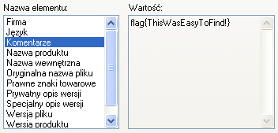
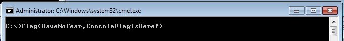
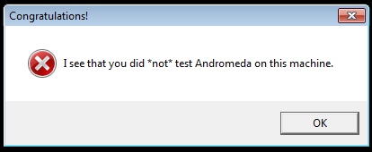
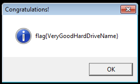

## Flag: `ThisWasEasyToFind!` (20 submissions)

A couple of minutes after we announced our challenge the file has already been uploaded to VirusTotal. Two of the tested antivirus solutions reported a false positive. The “File details” tab contains one of the flags. This was hidden in the “Comments” string of the file metadata. This data is displayed (at least in Windows XP) upon right clicking on the file and choosing “Properties”, as the screenshot below shows. 

 

Alternatively, one could run the
`strings`
tool with
`-e l`
. This option resulted in showing the strings which where encoded in 16-bit Unicode in the Little Endian convention. The command is presented below, flag is in the 9th line.

```
$ strings -e l ./CrackMe.exe
INTERESTING_PCITURE
VS_VERSION_INFO
VarFileInfo
Translation
StringFileInfo
04090025
Comments
flag{ThisWasEasyToFind!}
CompanyName
CERT Polska
FileDescription
CrackMe
FileVersion
InternalName
LegalCopyright
CERT Polska
LegalTrademarks
OriginalFilename
PrivateBuild
ProductName
CrackMe
ProductVersion
SpecialBuild
```

## Flag: `HowToFindStringsInPEYouKnow` (15 submissions)

This flag could also be found by using the
`strings`
tool. However, this time the binary file had to be unpacked. This file was packed with UPX, however one of the section names was changed. This resulted in a failure when one tried to use the standard tool:

```
$ upx -d ../CrackMe.exe
Ultimate Packer for eXecutables
Copyright (C) 1996 - 2013
UPX 3.09 Markus Oberhumer, Laszlo Molnar &amp; John Reiser Feb 18th 2013

File size Ratio Format Name
-------------------- ------ ----------- -----------
upx: ../CrackMe.exe: CantUnpackException: file is modified/hacked/protected; take care!!!

Unpacked 0 files.
```

Offsets 179-17C contained a
`XXX0`
string, while normally it should be
`UPX0`
. This name change could be reversed using a standard text editor. After this change file should unpack normally and after running the
`strings`
tool we find a string:
`ZmxhZ3tIb3dUb0ZpbmRTdHJpbmdzSW5QRVlvdUtub3d9Cg==`
which is just a base64 encoded flag.

## Flag: `HaveNoFear,ConsoleFlagIsHere!` (13 submissions)

This flag was also easy to find. All you have to have is
`windows\system32\cmd.exe`
running in the background, while starting our CrackMe. Flag was then written in the console, as is pictured below.



## Flag: `VeryGoodHardDriveName` (10 submissions)

Second dialog box that was showed when you simply run
`CrackMe.exe`
is the one pictured below.



It contained a clue that pointed to the Andromeda malware. This malware had a VM check implemented, and if it succeeded in detecting the VM than it executed a decoy code. However, malware authors also have tested Andromeda in a virtual environment, so they implemented a check that allowed users to bypass the VM detection. If the
`C:`
had a label with CRC32 equal to
`0x20C7DD84`
(most notably
`CKF81X`
) our CrackMe displayed a new flag (pictured below).



## Flag: `YouKnowHowToDebugCode!` (9 submissions)

In order to find this flag CrackMe had to be debugged using e.g. OllyDbg or IDA Pro. The code check the debugger presence using the
`IsDebuggerPresent`
function. If it detected the debugger a
`You shall not pass!`
dialog box appeared. However, code continued to the function which used
`OutputDebugString`
to display a string. This string was obtained by xoring
`changeme`
with the previously “encrypted” byte array:

```
0x39,0x47,0x47,0x46,0xa,0x6,0x44,0x53,0x6a,0x1f,0x30,0x5c,0x6e,0x4e,0x6,0xb,0x44,0x62,0x44,0x13,0x2a,0x4c,0x65,0x4e,0x15,0x3a,0xa,0x5b
```

Of course
`changeme`
had to be change to the correct password. Assuming that we know that the first 5 characters of the string are
`flag{`
, and only first 5 bytes from
`changeme`
were used as a key, we could easily calculate correct password:

```
0x39 xor 0x66 (‘f’) = 0x5f (‘_’)
0x47 xor 0x6c (‘l’) = 0x2b (‘+’)
0x47 xor 0x61 (‘a’) = 0x26 (‘&’)
0x46 xor 0x67 (‘g’) = 0x21 (‘!’)
0x0a xor 0x7b (‘{‘) = 0x71 (‘q’)
```

So the password is
`_+&!q`
and it can be used to decode byte array and obtain a flag. This can be achieved manually or by simply substituting
`changeme`
with
`_+&!q`
in the debugger.
